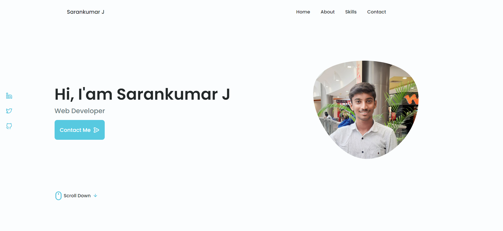
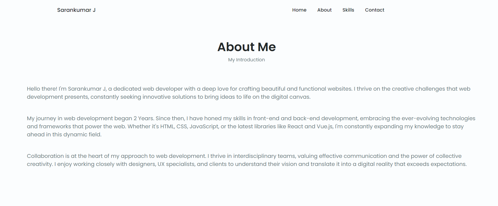
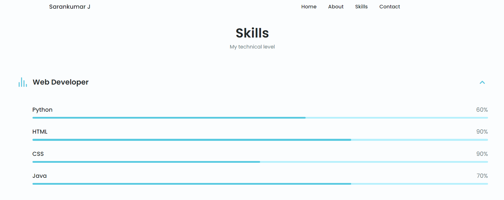
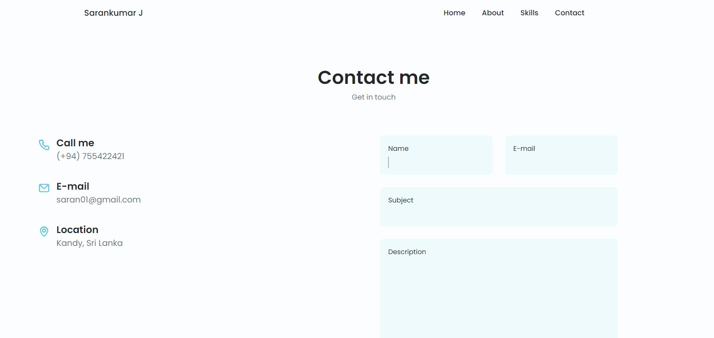

# Ex-01 : To-create-a-web-Portfolio-CV-using-HTML-CSS
## Aim:-
To create a web Portfolio CV using HTML CSS
### Step 1:
index.html: The main HTML file.
### Step 2:
style.css: The CSS file for styling the portfolio.
### Step 3:
Add content to the portfolio
### Step 4:
Link the CSS file
### Step 5:
Style the portfolio using CSS
### Step 6:
Publish your portfolio
## Program:-
### Index.html
```html
<!--==================== HEADER ====================-->
        <header class="header" id="header">
            <nav class="nav container">
                <a href="#" class="nav__logo">Sarankumar J</a>
                <div class="nav__menu" id="nav-menu">
                    <ul class="nav__list grid">
                        <li class="nav__item">
                            <a href="#home" class="nav__link">
                                <i class="uil uil-estate nav__icon"></i>Home
                            </a>
                        </li>
                        <li class="nav__item">
                            <a href="#about" class="nav__link">
                                <i class="uil uil-user nav__icon"></i>About
                            </a>
                        </li>
                        <li class="nav__item">
                            <a href="#skills" class="nav__link">
                                <i class="uil uil-file-alt nav__icon"></i>Skills
                            </a>
                        </li>

                        <li class="nav__item">
                            <a href="#contact" class="nav__link">
                                <i class="uil uil-message nav__icon"></i>Contact                               
                            </a>
                        </li>
                    </ul>
                    <i class="uil uil-times nav__close" id="nav-close"></i>
                </div>
                </div>
            </nav>
        </header>
            <!--==================== ABOUT ====================-->
            <section class="about section" id="about">
                <h2 class="section__title">About Me</h2>
                <span class="section__subtitle">My Introduction</span>

                <div class="about__container container grid">
                    <div class="about__data">
                        <p class="about__description">
                            Hello there! I'm Sarankumar J, a dedicated web developer with a deep love for crafting beautiful and functional websites. I thrive on the creative challenges that web development presents, constantly seeking innovative solutions to bring ideas to life on the digital canvas.
                        </p>
                        <p class="about__description">My journey in web development began 2 Years. Since then, I have honed my skills in front-end and back-end development, embracing the ever-evolving technologies and frameworks that power the web. Whether it's HTML, CSS, JavaScript, or the latest libraries like React and Vue.js, I'm constantly expanding my knowledge to stay ahead in this dynamic field.</p>
                        <p class="about__description">Collaboration is at the heart of my approach to web development. I thrive in interdisciplinary teams, valuing effective communication and the power of collective creativity. I enjoy working closely with designers, UX specialists, and clients to understand their vision and translate it into a digital reality that exceeds expectations.</p>
                    </div>
                </div>
            </section>
              <!--==================== QUALIFICATION ====================-->
        <section class="qualification__section">
            <h2 class="section__title">Qualification</h2>
            <span class="section__subtitle">My personal journey</span>

            <div class="qualification__container container">
                <div class="qualification__tabs">
                    <div class="qualification__button button--flex qualification__active" data-target='#education'>
                        <i class="uil uil-graduation-cap qualification__icon"></i>
                        Education
                    </div>

                    <div class="qualification__button button--flex" data-target="#work">
                        <i class="uil uil-briefcase-alt qualification__icon"></i>
                        Work
                    </div>
                </div>

                <div class="qualification__sections">
 <!--==================== CONTACT ME ====================-->
        <section class="contact section" id="contact">
            <h2 class="section__title">Contact me</h2>
            <span class="section__subtitle">Get in touch</span>

            <div class="contact__container container grid">
                <div>
                    <div class="contact__information">
                        <i class="uil uil-phone-alt contact__icon"></i>

                        <div>
                            <h3 class="contact__title">Call me</h3>
                            <span class="contatc__subtitle">(+94) 755422421</span>
                        </div>
                    </div>

                    <div class="contact__information">
                        <i class="uil uil-envelope contact__icon"></i>

                        <div>
                            <h3 class="contact__title">E-mail</h3>
                            <span class="contatc__subtitle">saran01@gmail.com</span>
                        </div>
                    </div>

                    <div class="contact__information">
                        <i class="uil uil-map-marker contact__icon"></i>

                        <div>
                            <h3 class="contact__title">Location</h3>
                            <span class="contatc__subtitle">Kandy, Sri Lanka</span>
                        </div>
                    </div>
                </div>

                <form action="" class="contact__form grid">
                    <div class="contact__inputs grid">
                        <div class="contact__content">
                            <label for="" class="contact__label">Name</label>
                            <input type="text" class="contact__input">
                        </div>

                        <div class="contact__content">
                            <label for="" class="contact__label">E-mail</label>
                            <input type="email" class="contact__input">
                        </div>
                    </div>

                    <div class="contact__content">
                        <label for="" class="contact__label">Subject</label>
                        <input type="text" class="contact__input">
                    </div>

                    <div class="contact__content">
                        <label for="" class="contact__label">Description</label>
                        <textarea name="" id="" cols="0" rows="7" class="contact__input"></textarea>
                    </div>

                    <div>
                        <a href="#" class="button button--flex">
                            Send message
                            <i class="uil uil-message button__icon"></i>
                        </a>
                    </div>
                </form>
            </div>

        </section>
    </main>
```
### Style.css
```css
/*==================== HOME ====================*/

.home__container {
  gap: 1rem;
}

.home__content {
  grid-template-columns: 0.5fr 3fr;
  padding-top: 3.5rem;
  align-items: center;
}

.home__social {
  display: grid;
  grid-template-columns: max-content;
  row-gap: 1rem;
}

.home__social-icon {
  font-size: 1.25rem;
  color: var(--first-color);
}

.home__social-icon:hover {
  color: var(--first-color-alt);
}

.home__blob {
  width: 200px;
  fill: var(--first-color);
}

.home__blob-img {
  width: 220px;
}

.home__data {
  grid-column: 1/3;
}

.home__title {
  font-size: var(--big-font-size);
}

.home__subtitle {
  font-size: var(--h3-font-size);
  color: var(--text-color);
  font-weight: var(--font-medium);
  margin-bottom: var(--mb-0-75);
}

.home__description {
  margin-bottom: var(--mb-2);
}

.home__scroll {
  display: none;
}

.home__scroll-button {
  color: var(--first-color);
  transition: 0.3s;
}

.home__scroll-button:hover {
  transform: translateY(0.25rem);
}

.home__scroll-mouse {
  font-size: 2rem;
}

.home__scroll-name {
  font-size: var(--small-font-size);
  color: var(--title-color);
  font-weight: var(--font-medium);
  margin-right: var(--mb-0-25);
}

.home__scroll-arrow {
  font-size: 1.25rem;
}
/*==================== BUTTONS ====================*/

.button {
  display: inline-block;
  background-color: var(--first-color);
  color: #ffff;
  padding: 1rem;
  border-radius: 0.5rem;
  font-weight: var(--font-medium);
}

.button:hover {
  background-color: var(--first-color-alt);
}

.button__icon {
  font-size: 1.2rem;
  margin-left: var(--mb-0-5);
  transition: 0.3s;
}

.button--white {
  background-color: #fff;
  color: var(--first-color);
}

.button--white:hover {
  background-color: #fff;
}

.button--flex {
  display: inline-flex;
  align-items: center;
  transition: 0.3s;
}

.button--small {
  padding: 0.75rem 1rem;
}

.button--link {
  padding: 0;
  background-color: transparent;
  color: var(--first-color);
}

.button--link:hover {
  background-color: transparent;
  color: var(--first-color-alt);
}

/*==================== ABOUT ====================*/
.about__img {
  width: 200px;
  border-radius: 0.5rem;
  justify-self: center;
  align-items: center;
}

.about__description {
  text-align: center;
  width: 220%;
  margin-bottom: var(--mb-2-5);
}

.about__info {
  display: flex;
  justify-content: space-evenly;
  margin-bottom: var(--mb-2-5);
}

.about__info-title {
  font-size: var(--h2-font-size);
  font-weight: var(--font-semi-bold);
  color: var(--title-color);
  text-align: center;
  width: 100;
}

.about__info-name {
  font-size: var(--smaller-font-size);
  text-align: center;
  width: 300;
}

.about__info-title,
.about__info-name {
  display: block;
  text-align: center;
}

.about__buttons {
  display: flex;
  justify-content: center;
}
/*==================== CONTACT ME ====================*/
.contact__container {
  row-gap: 3rem;
}

.contact__information {
  display: flex;
  margin-bottom: var(--mb-2);
}

.contact__icon {
  font-size: 1.5rem;
  color: var(--first-color);
  margin-right: var(--mb-0-75);
}

.content__title {
  font-size: var(--h3-font-size);
  font-weight: var(--font-medium);
}

.contact__subtitle {
  font-size: var(--small-font-size);
  color: var(--text-color-light);
}

.contact__content {
  background-color: var(--input-color);
  border-radius: 0.5rem;
  padding: 0.75rem 1rem 0.25rem;
}

.contact__label {
  font-size: var(--smaller-font-size);
  color: var(--title-color);
}

.contact__input {
  width: 100%;
  background-color: var(--input-color);
  color: var(--text-color);
  font-family: var(--body-font);
  font-size: var(--normal-font-size);
  border: none;
  outline: none;
  padding: 0.25rem 0.5rem 0.5rem 0;
}
```
## Output:-





## Result:-
Thus the program To created a web Portfolio/CV using HTML & CSS Successfully